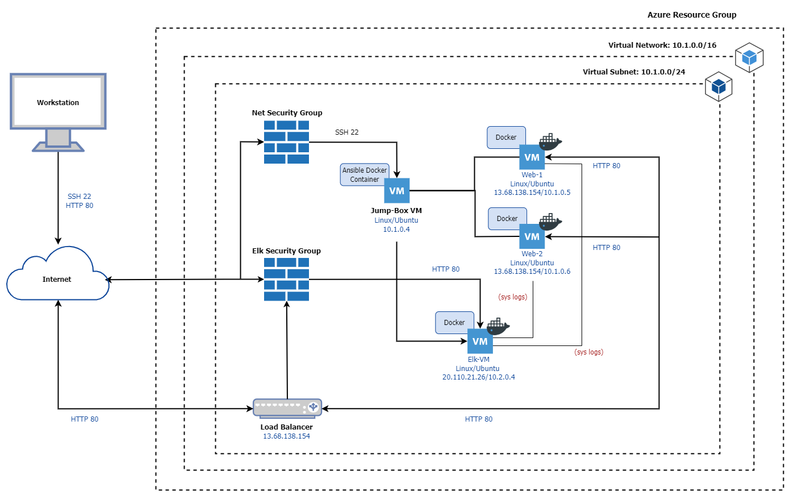
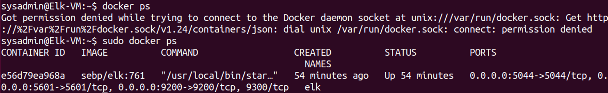

## Automated ELK Stack Deployment

The files in this repository were used to configure the network depicted below.

These files have been tested and used to generate a live ELK deployment on Azure. They can be used to either recreate the entire deployment pictured above. Alternatively, select portions of the Ansible file may be used to install only certain pieces of it, such as Filebeat.

  - /etc/ansible/install-elk.yml

This document contains the following details:
- Description of the Topology
- Access Policies
- ELK Configuration
  - Beats in Use
  - Machines Being Monitored
- How to Use the Ansible Build

### Description of the Topology

The main purpose of this network is to expose a load-balanced and monitored instance of DVWA, the D*mn Vulnerable Web Application.

Load balancing ensures that the application will be highly secure, in addition to restricting traffic to the network.
- The load balancers distribute the traffic received from a website across several servers evenly in order to mitigate attacks so if one of the servers go down, another one can continue to be in use. Jumpboxes are an advantage because it allows access to the user from one node that can be easily secured and monitored and is the only access point required to connect before proceeding with any other tasks/performances.

Integrating an ELK server allows users to easily monitor the vulnerable VMs for changes to the logs and system traffic.
- Filebeat collects log files that it generates or organizes including files that are changed.It usually aids in building the collected data on specific files from the collected logs and continues to monitor these logs.
- Metricbeat collects and ships various system and service metrics to specified destinations and is used to monitor performance and the different services running on them.

| Name     | Function | IP Address                                      | Operating System |
|----------|----------|-------------------------------------------------|------------------|
| Jump-Box | Gateway  | Private IP: 10.1.0.4 - Public IP: N/A           | Linux            |
| Web-1    | Server   | Private IP: 10.1.0.5 - Public IP: 13.68.138.154 | Linux            |
| Web-2    | Server   | Private IP: 10.1.0.6 - Public IP: 13.68.138.154 | Linux            |
| Elk-VM   | Monitor  | Private IP: 10.2.0.4 - Public IP: 20.110.21.26  | Linux            |

### Access Policies

The machines on the internal network are not exposed to the public Internet. 

Only the Jumpbox machine can accept connections from the Internet. Access to this machine is only allowed from the following IP addresses:
- 5601 Kibana Port

Machines within the network can only be accessed by the Jump Box Provisioner.
- The Jumpbox VM is allowed to access the Elk VM. The private IP: 10.1.0.4

A summary of the access policies in place can be found in the table below.

| Name     | Publicly Accessible | Allowed IP Addresses |
|----------|---------------------|----------------------|
| Jump-Box |        Yes/No       |     76.234.225.58    |
| Web-1    |          No         |       10.1.0.4       |
| Web-2    |          No         |       10.1.0.4       |
| Elk-VM   |          No         |       10.1.0.4       |

### Elk Configuration

Ansible was used to automate configuration of the ELK machine. No configuration was performed manually, which is advantageous because...
- Ansible is easy for set up and usage as well as easily customizable based off the needs of the user. No other installations of software or applications are needed in order to automate the ansible.

The playbook implements the following tasks:
- Install docker.io
- Install pip3
- Install Docker module
- Increase virtual memory
- Download and launch the docker
- Enable service docker on boot

The following screenshot displays the result of running `docker ps` after successfully configuring the ELK instance.

### Target Machines & Beats
This ELK server is configured to monitor the following machines:
| Name  | IP Address |
|-------|------------|
| Web-1 |  10.1.0.5  |
| Web-2 |  10.1.0.6  |

We have installed the following Beats on these machines:
- Filebeat
- Metricbeat

These Beats allow us to collect the following information from each machine:
- Filebeat monitors and collects log data. This log information is then forwarded to Elasticsearch or Logstash.
- Metricbeat provides information through metrics from the system or services on the server.

### Using the Playbook
In order to use the playbook, you will need to have an Ansible control node already configured. Assuming you have such a control node provisioned: 

SSH into the control node and follow the steps below:
- Copy the playbook file to /etc/ansible.
- Update the configuration file to include the webservers and elk (Private IP)
- Run the playbook, and navigate to Elk-VM to check that the installation worked as expected.

Which file is the playbook? Where do you copy it?
- The file is /etc/ansible/filebeat-playbook.yml and it should be located as directed in the path: /etc/ansible

Which file do you update to make Ansible run the playbook on a specific machine? How do I specify which machine to install the ELK server on versus which to install Filebeat on?

- /etc/ansible/hosts. To specify the machine, allow the webserver and elk to be added with the private IPs of the machines.\

Which URL do you navigate to in order to check that the ELK server is running?

- http://[your.ELK-VM.External.IP]:5601/app/kibana